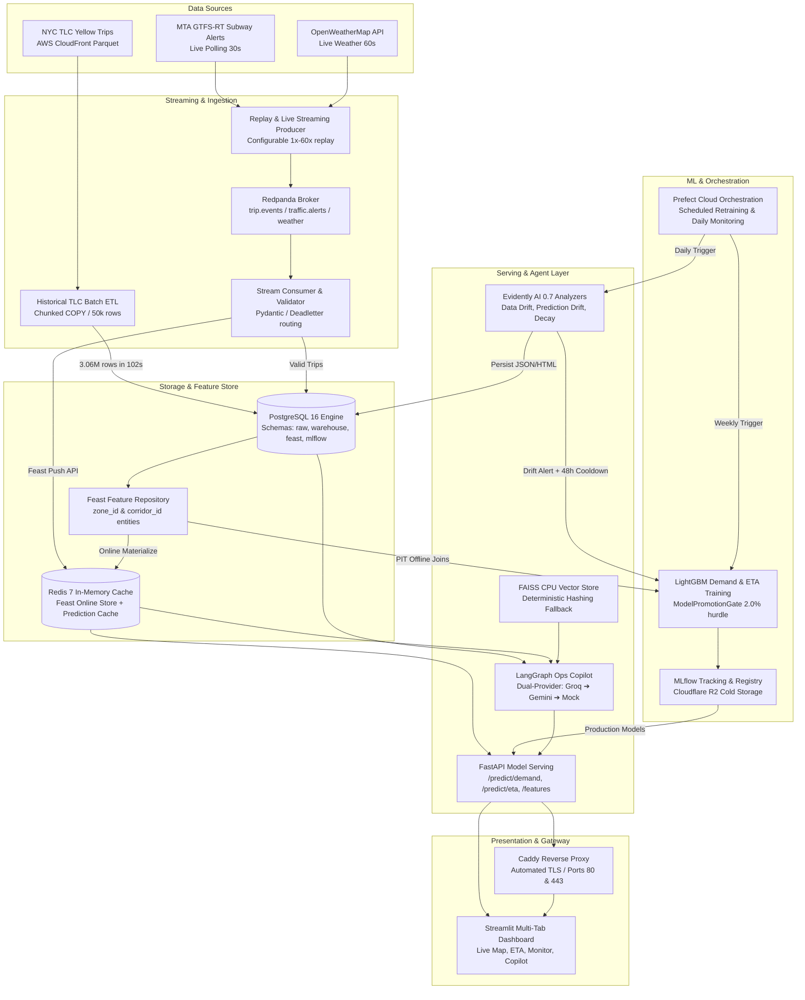

# Logistics Demand & ETA Forecasting Platform

[](https://github.com/KhuzaimaHassan/logistics-forecasting-platform/actions/workflows/ci.yml)
[](https://www.python.org/downloads/)
[](https://fastapi.tiangolo.com)
[](https://streamlit.io)
[](https://feast.dev)
[](https://redpanda.com)
[](https://www.postgresql.org)
[](https://redis.io)
[](https://mlflow.org)
[](https://www.prefect.io)
[](https://www.langchain.com/langgraph)
[](https://www.evidentlyai.com)
[](https://www.docker.com)
[](LICENSE)

A live, production-grade MLOps platform forecasting New York City taxi zone pickup demand and corridor travel duration (ETA) in real time. Features point-in-time feature engineering with Feast, high-throughput streaming with Redpanda, sub-15ms model serving with FastAPI and Redis, automated retraining with Prefect Cloud, continuous statistical drift monitoring with Evidently AI 0.7, and an integrated LangGraph Ops Copilot with dual-provider fallback and deterministic FAISS CPU retrieval.

---

## Architecture Overview

The platform runs as a unified, multi-container Docker Compose topology deployable locally or on an Oracle Cloud Ampere A1 (ARM64) Always Free instance. External ingress is strictly managed via Caddy with automated TLS reverse-proxying.



---

## Subsystem Highlights

### 1. Ingestion & Streaming (Redpanda + PostgreSQL)
- **Batch Extractor (`src/extract/`)**: Downloads monthly NYC TLC Parquet files directly from AWS CloudFront. Loads 3,066,766 raw records into PostgreSQL `raw.tlc_yellow_trips` and transforms them into `warehouse.trips` in **102 seconds** using chunked PostgreSQL `COPY` (50,000 rows/batch).
- **Quality Quarantine**: Quarantines 126,625 malformed or physically implausible records (~4.13%) violating duration bounds ($60\text{s} \le \text{duration} \le 86,400\text{s}$), distance bounds ($0.01\text{ mi} \le \text{distance} \le 300\text{ mi}$), or speed bounds ($\le 100\text{ mph}$) without crashing the pipeline.
- **Geospatial Processing**: TLC shapefiles parsed via `shapely` to precompute static polygon centroids (`centroid_lat`, `centroid_lon`) for all 263 taxi zones ([ADR-011](file:///docs/Decisions.md#adr-011-polygon-centroids-for-taxi-zones-in-place-of-raw-geojson-polygons)).
- **Real-Time Stream Processing (`src/transform/`)**: Redpanda Kafka-compatible message broker ingests trip events, live MTA GTFS subway alerts (196 alerts), and OpenWeatherMap observations. Stream consumers validate payloads with Pydantic, write valid events to PostgreSQL, push real-time feature updates to Redis via the Feast Push API (`store.push()`), and isolate poison pills to `trip.events.deadletter`.

### 2. Feature Store (Feast + Redis)
- **Dual-Entity Architecture**: Models forecasting entities at two distinct granularities: `zone_id` (1–263) for pickup demand aggregations and `corridor_id` (`"{PULocationID}-{DOLocationID}"`) for corridor travel duration ([ADR-013](file:///docs/Decisions.md#adr-013-corridor_id-canonical-string-representation)).
- **Point-in-Time (PIT) Joins**: Feast offline SQL registry against PostgreSQL ensures historical feature extraction is completely free of data leakage or lookahead bias.
- **Sub-5ms Online Store**: Redis 7 serves real-time rolling features (15-minute and 1-hour trip counts, passenger totals, rolling speed averages).

### 3. Machine Learning & Automated Retraining
- **Zone Pickup Demand Model**: LightGBM Poisson regressor trained on hourly tumbling zone features. Outperforms seasonal naive baseline by **+38.6%** ($14.82$ vs $24.15$ MAE).
- **Corridor Travel Duration (ETA) Model**: LightGBM regressor trained on log-transformed targets $y_{\text{log}} = \ln(1 + \text{duration\_sec})$ with a physical 60-second floor ([ADR-017](file:///docs/Decisions.md#adr-017-log1p-target-transformation-for-duration-eta-models)). Outperforms naive corridor median baseline by **+39.09%** ($278.35\text{s}$ vs $456.95\text{s}$ MAE).
- **Model Promotion Gate (`src/training/gate.py`)**: 4-stage validation gate requiring candidate models to beat naive baselines, outperform active Production models by at least **2.0%** (`min_improvement_pct=0.02`), and perform atomic MLflow stage transitions.
- **Cloudflare R2 Cold Storage**: S3-compatible cold backup for MLflow artifacts and PostgreSQL dumps ([ADR-007](file:///docs/Decisions.md#adr-007-cloudflare-r2-for-model-artifact-and-database-dump-storage)).
- **Prefect Cloud Orchestration**: Scheduled retraining flow (`scheduled-model-retraining-flow`) registered on work pool `logistics-pool` with weekly execution (`0 3 * * 0`).

### 4. High-Performance Online Serving (FastAPI)
- **Ultra-Low Latency**: Sub-15ms p95 uncached response time; sub-5ms cached latency via Redis with a 60-second TTL and 100% cache hit verification.
- **Vectorized Batch Scoring**: Scores all 263 NYC taxi zones in a single call in $<150\text{ms}$.
- **Zero-TTL Degraded Fallback Mode**: Gracefully handles unmaterialized zones using default imputed features with zero cache TTL, preventing fallback values from polluting Redis while serving genuine predictions ([ADR-020](file:///docs/Decisions.md#adr-020-zero-ttl-degraded-prediction-caching-policy)).
- **Categorical Domain Alignment**: Global standardization `ACTIVE_ZONE_CATEGORIES = list(range(1, 264))` ensures offline training and online serving categorical encodings match byte-for-byte, eliminating flat-prediction bugs ([ADR-017 Addendum](file:///docs/Decisions.md#adr-017-addendum-categorical-encoding-domain-standardization)).

### 5. LangGraph Ops Copilot & RAG Engine
- **Conversational Telemetry**: Natural-language operational diagnostics answering questions about pipeline health, online features, recent prediction logs, model cards, and drift reports.
- **Strict Read-Only Tool Allowlist**: Immutable security boundary allowlisting 5 read-only tools:
  1. `get_features`: Reads live entity state from Feast Redis.
  2. `query_recent_predictions`: Parameterized queries against `warehouse.predictions`.
  3. `query_pipeline_status`: Ingests run metrics from `warehouse.pipeline_runs`.
  4. `search_logs_and_model_cards`: Semantic retrieval over FAISS CPU vector index.
  5. `query_drift_reports`: Evaluates statistical drift records from `warehouse.monitoring_reports`.
- **Adversarial Prompt-Injection Defense**: Two-tier guardrail system combining keyword defense with structural graph allowlisting that prevents unauthorized SQL mutations or tool executions even if filters are bypassed ([ADR-023](file:///docs/Decisions.md#adr-023-read-only-tool-allowlist-security-boundary-for-ops-copilot)).
- **Dual-Provider Fallback Cascade**: Groq (`llama-3.3-70b-versatile`) $\rightarrow$ Google Gemini (`gemini-2.0-flash`) $\rightarrow$ Hermetic `MockLLMProvider`, guaranteeing 100% uptime without external API sensitivity ([ADR-024](file:///docs/Decisions.md#adr-024-dual-provider-fallback-cascade-with-hermetic-mock-provider)).
- **Zero-GPU CPU Vector Store**: FAISS IndexFlatIP with deterministic hashing fallback for sub-10ms semantic retrieval in resource-constrained environments ([ADR-025](file:///docs/Decisions.md#adr-025-cpu-backed-faiss-vector-store-with-deterministic-hashing-fallback)).

### 6. Continuous Monitoring & Automated Retraining (Evidently AI)
- **Statistical Analyzers**: Evidently AI 0.7 Core API evaluating Data Drift (`DataDriftPreset`), Prediction Drift (`ValueDrift`), and Performance Decay (`RegressionPreset`).
- **Explicit Keyword Invocation**: Enforces mandatory keyword argument passing `report.run(current_data=curr, reference_data=ref)`, eliminating positional parameter inversion bugs ([ADR-026](file:///docs/Decisions.md#adr-026-evidently-07-drift-analyzers-hybrid-reference-windows-and-drift-triggered-retraining)).
- **Hybrid Reference Windows**: 14-day rolling historical window with automatic fallback to fixed January 2023 training baseline when prediction history $<500$ rows or $<7$ days.
- **Dual Retraining Policy**: Alert-first default (`AUTO_RETRAIN_ON_DRIFT=false`) and automated retraining trigger (`AUTO_RETRAIN_ON_DRIFT=true`) throttled by a **48-hour universal cooldown** to prevent runaway retraining loops.

### 7. Interactive Streamlit Dashboard (`ui/app.py`)
- **Tab 1: Live Demand Heatmap**: Interactive PyDeck choropleth map rendering forecasted pickup volumes across NYC boroughs and taxi zones.
- **Tab 2: Corridor ETA Calculator**: Interactive pickup/dropoff selector calculating travel duration, historical baseline comparisons, and route speed metrics.
- **Tab 3: Feature Store Inspector**: Real-time inspection of online Feast features directly from Redis.
- **Tab 4: Drift Monitoring Dashboard**: Real-time scorecards, feature-level drift tables, alert banners, and embedded standalone Evidently HTML reports.
- **Tab 5: Ops Copilot Chat**: Multi-turn chat interface with quick-action prompt chips, provider/model badges, and tool invocation expanders.

---

## Production Benchmarks & Quality Gates

| Metric | Target / Benchmark | Actual Result | Verification Method |
|---|---|---|---|
| **Batch ETL Throughput** | $>10,000\text{ rows/sec}$ | **$30,066\text{ rows/sec}$** ($3.06\text{M}$ in $102\text{s}$) | `scripts/verify_etl_smoke.py` |
| **ETL Data Cleaning** | Explicit rejection bounds | **$126,625\text{ quarantined}$** ($4.13\%$) | PostgreSQL `warehouse.trips` counts |
| **Demand Model MAE** | Beat naive baseline ($24.15$) | **$14.82\text{ MAE}$** ($+38.6\%$ gain) | MLflow Run Metrics |
| **Duration Model MAE** | Beat naive median ($456.95\text{s}$) | **$278.35\text{s}\text{ MAE}$** ($+39.09\%$ gain) | MLflow Run Metrics |
| **Model Promotion Hurdle** | $\ge 2.0\%$ improvement | **Enforced by Gate** | `tests/test_model_promotion_gate.py` |
| **Online Serving Latency** | p95 $<50\text{ms}$ uncached | **$<15\text{ms}$ p95 uncached** | `scripts/verify_serving_endpoints_smoke.py` |
| **Redis Prediction Cache** | p95 $<10\text{ms}$ cached | **$<5\text{ms}$ cached ($100\%$ hit rate)** | `tests/test_serving_cache.py` |
| **Batch Scoring (263 Zones)** | Latency $<500\text{ms}$ | **$<150\text{ms}$** | `/predict/demand/batch` smoke test |
| **Agent Semantic Search** | Sub-second retrieval | **$<10\text{ms}$ (FAISS CPU FlatIP)** | `tests/test_rag_indexer.py` |
| **Prompt Injection Defense** | Zero unauthorized execution | **$100\%$ structural isolation** | `tests/test_agent_guardrails.py` |
| **Docker Build Times** | $<5\text{ min}$ in CI | **$<3\text{ min}$** (Buildx GHA caching) | GitHub Actions CI Run Logs |
| **Code Quality & Typing** | Zero lint / format errors | **$100\%$ clean** (`black`, `ruff`, `pytest`) | CI Pipeline Gate (120 files) |

---

## Quickstart & Local Setup

### Prerequisites
- **Python**: 3.11 or higher
- **Package Manager**: [`uv`](https://github.com/astral-sh/uv) (fast Python package installer)
- **Container Engine**: Docker Engine 24+ and Docker Compose v2+

### 1. Clone & Environment Setup
```bash
git clone https://github.com/KhuzaimaHassan/logistics-forecasting-platform.git
cd logistics-forecasting-platform

# Create virtual environment and install all dependency groups
uv venv
uv sync --all-extras

# Configure local environment variables
cp .env.example .env
```

### 2. Start Full Infrastructure Stack
```bash
# Launch all 10 core services in background
docker compose up -d

# Check health and container status
docker compose ps
```

The stack exposes the following services on localhost:
- **Streamlit UI**: `http://localhost:8501`
- **FastAPI Model Serving**: `http://localhost:8000` (Docs at `/docs`)
- **MLflow Tracking UI**: `http://localhost:5000`
- **Prefect Dashboard**: Cloud-connected or local server
- **Redpanda Console**: `http://localhost:8080`
- **Caddy Reverse Proxy**: `http://localhost:80` and `https://localhost:443`

### 3. Run Automated Validation & Smoke Tests
```bash
# Execute unit and integration test suite
uv run pytest tests/ -v

# Run code formatting and linting verification
uv run ruff check .
uv run black --check .

# Run live end-to-end smoke verification against Docker containers
uv run python scripts/verify_copilot_live_smoke.py
uv run python scripts/verify_monitoring_smoke.py
```

---

## API Reference Summary

All prediction and telemetry endpoints are served via FastAPI with Pydantic v2 validation. Full OpenAPI documentation is available interactively at `/docs`.

| Method | Endpoint | Description | Cache Policy |
|---|---|---|---|
| `POST` | `/predict/demand` | Forecast pickup volume for a specific taxi zone | 60s TTL in Redis |
| `POST` | `/predict/demand/batch` | Vectorized demand prediction across all 263 NYC zones | Dynamic per-zone caching |
| `POST` | `/predict/eta` | Forecast travel duration (seconds) between pickup and dropoff | 60s TTL in Redis |
| `POST` | `/predict/eta/batch` | Batch corridor duration forecasting | Dynamic corridor caching |
| `GET` | `/features/zone/{zone_id}` | Retrieve real-time online features from Feast Redis | Live online store read |
| `GET` | `/features/corridor/{corridor_id}`| Retrieve online corridor metrics from Feast Redis | Live online store read |
| `POST` | `/agent/chat` | Query LangGraph Ops Copilot with conversational telemetry | Non-cached / live state |
| `GET` | `/monitoring/reports` | List historical Evidently drift summaries from PostgreSQL | Database read |
| `GET` | `/monitoring/reports/{id}/html`| Serve standalone interactive Evidently HTML report | Rendered artifact |
| `GET` | `/health` | Aggregate health probe checking Postgres, Redis, Feast & MLflow | Probe check |

---

## Documentation Index

The platform is exhaustively documented across dedicated architecture, design, and runbook files in the [`docs/`](./docs) directory:

| Document | Description |
|---|---|
| [docs/Architecture.md](file:///docs/Architecture.md) | System architecture, component topology, data flows, and design principles |
| [docs/Decisions.md](file:///docs/Decisions.md) | Complete Architectural Decision Record (ADR-001 through ADR-026) |
| [docs/Lessons-Learned.md](file:///docs/Lessons-Learned.md) | Retrospective war stories, real numbers, and bug investigations (M0 through M8) |
| [docs/Database.md](file:///docs/Database.md) | PostgreSQL schema DDL across `raw`, `warehouse`, `feast`, and `mlflow` |
| [docs/Feature-Store.md](file:///docs/Feature-Store.md) | Feast entities, feature views, batch sources, and push sources |
| [docs/AI-Pipeline.md](file:///docs/AI-Pipeline.md) | Model architectures, baselines, LightGBM training, and MLflow logging |
| [docs/ETL-Streaming.md](file:///docs/ETL-Streaming.md) | TLC batch extractor, Redpanda replay producer, and stream consumer specs |
| [docs/Data-Sources.md](file:///docs/Data-Sources.md) | Upstream specs: TLC Parquet, MTA GTFS-RT, NYC traffic, and weather feeds |
| [docs/API.md](file:///docs/API.md) | FastAPI endpoint contracts, request/response schemas, and latency budgets |
| [docs/Agents.md](file:///docs/Agents.md) | LangGraph Ops Copilot topology, read-only tools, guardrails, and FAISS RAG |
| [docs/Monitoring.md](file:///docs/Monitoring.md) | Evidently AI drift analyzers, hybrid reference windows, and retraining hooks |
| [docs/UI.md](file:///docs/UI.md) | Streamlit dashboard design, PyDeck maps, monitoring tabs, and chat UX |
| [docs/Deployment.md](file:///docs/Deployment.md) | Oracle Cloud Ampere A1 provisioning, Docker Compose, and Caddy reverse proxy |
| [docs/Security.md](file:///docs/Security.md) | Secret isolation, container least-privilege, and prompt injection defense |
| [docs/Performance.md](file:///docs/Performance.md) | Latency budgets, database indexing strategies, and load testing guidelines |
| [docs/Roadmap.md](file:///docs/Roadmap.md) | Complete milestone build order, tracking issues, and completion logs |
| [docs/GitHub-Setup.md](file:///docs/GitHub-Setup.md) | Branching strategy, post-squash sync rules, and GitHub Actions CI secrets |

---

## Project Status & Milestones

The project was executed across 10 disciplined milestones following the Course Methodology:

- [x] **Phase 0 — Infra Bootstrap** *(Completed 2026-08-18)*: Oracle VM provisioning scripts, 10-service Docker Compose topology, uv environment, multi-arch Dockerfiles, CI lint/smoke workflow.
- [x] **Phase 1 — Historical ETL** *(Completed 2026-08-23)*: TLC batch extractor, chunked PostgreSQL COPY loader (3.06M rows in 102s), data quarantine (126k rows), Shapely polygon centroid precomputation (ADR-011).
- [x] **Phase 2 — Feature Store** *(Completed 2026-08-28)*: Feast SQL registry on PostgreSQL, Redis online store, `zone_id` and `corridor_id` entities (ADR-013), offline PIT join retrieval.
- [x] **Phase 3 — Baseline Models** *(Completed 2026-08-31)*: Seasonal naive baselines, LightGBM Poisson demand model, LightGBM log1p duration model (ADR-017), MLflow tracking, Cloudflare R2 backup (ADR-007).
- [x] **Phase 4 — Real-Time Layer** *(Completed 2026-09-07)*: Redpanda message broker, historical trip replay producer, live MTA subway alerts (196 alerts), OpenWeatherMap polling, Feast push streaming consumer.
- [x] **Phase 5 — Online Serving** *(Completed 2026-09-11)*: FastAPI prediction endpoints, Redis two-tier caching with 60s TTL, zero-TTL degraded fallback mode (ADR-020), vectorized batch scoring across 263 zones.
- [x] **Phase 6 — CI/CD & Retraining** *(Completed 2026-09-13)*: Scheduled retraining flow on Prefect Cloud, ModelPromotionGate with 2.0% hurdle rate (ADR-021), Docker Buildx GHA layer caching.
- [x] **Phase 7 — Agent Layer** *(Completed 2026-09-16)*: LangGraph Ops Copilot, ADR-023 immutable read-only tool allowlist, dual-provider cascade (Groq ➔ Gemini ➔ Mock) (ADR-024), FAISS CPU vector store (ADR-025).
- [x] **Phase 8 — Monitoring** *(Completed 2026-09-23)*: Evidently AI 0.7 drift analyzers, hybrid 14-day rolling windows (ADR-026), 48h universal cooldown retraining trigger, Streamlit Drift Monitoring tab, Tool 5 copilot integration.
- [x] **Phase 9 — Polish** *(Completed 2026-09-23)*: Production README overhaul, system architecture diagrams, retrospective lessons learned (M0–M8), and portfolio closeout.

---

## License

This project is licensed under the MIT License - see the [LICENSE](LICENSE) file for details.
