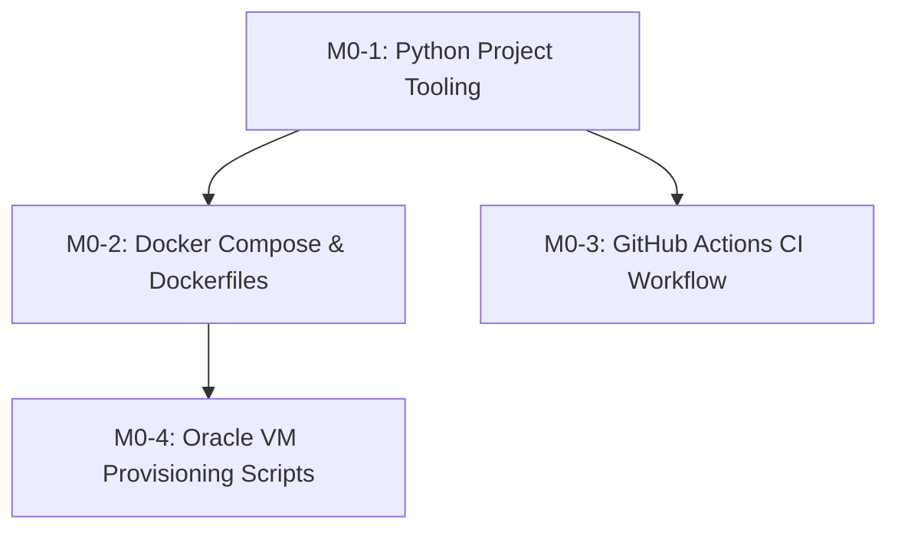

# Ticket Breakdown — Phase 0: Infra Bootstrap

## Epic Summary
Bootstrap the foundation infrastructure for the Logistics Demand & ETA Forecasting Platform: establish local Python tooling with `uv`, single-host Docker Compose service topology, multi-arch Dockerfile skeletons, GitHub Actions CI validation, and Oracle Cloud VM setup scripts.

---

## Tickets

### M0-1: Python Project Configuration & Tooling Baseline
- **Scope / Acceptance Criteria:**
  - Create root `pyproject.toml` with Python 3.11+ requirements, dev dependencies (`pytest`, `ruff`, `black`), and build configuration.
  - Configure `ruff` lint rules and `black` formatter settings.
  - Add basic smoke test in `tests/test_smoke.py` verifying the test harness works cleanly with `pytest`.
- **Per-Ticket Context:** `docs/Environment-Setup.md`, `docs/Contributing.md`, `AGENTS.md`.
- **Files Touched:** `pyproject.toml`, `tests/test_smoke.py`.
- **Estimated Size:** ~100–150 lines.
- **Depends On:** None.

### M0-2: Multi-Service Docker Compose & Dockerfile Skeletons
- **Scope / Acceptance Criteria:**
  - Create `docker-compose.yml` (and link `infra/docker-compose.yml`) containing all 10 services defined in `docs/Deployment.md`:
    - `caddy` (ports 80, 443 exposed)
    - `postgres` (internal port 5432, persistent volume)
    - `redis` (internal port 6379, persistent volume)
    - `redpanda` (internal port 9092, persistent volume)
    - `mlflow` (internal port 5000, persistent volume)
    - `prefect-worker` (connected to Prefect Cloud)
    - `stream-producer` (custom service skeleton)
    - `stream-consumer` (custom service skeleton)
    - `fastapi` (internal port 8000)
    - `streamlit` (internal port 8501)
  - Create multi-arch Dockerfiles: `src/extract/Dockerfile`, `src/transform/Dockerfile`, `src/serving/Dockerfile`, `ui/Dockerfile`.
  - Create `infra/docker/Caddyfile` for reverse-proxy routing to FastAPI (`/api/`, `/health`, `/predict/`, `/agent/`) and Streamlit (`/`).
- **Per-Ticket Context:** `docs/Deployment.md`, `docs/Decisions.md` (ADR-002, ADR-003, ADR-008).
- **Files Touched:** `docker-compose.yml`, `infra/docker/Caddyfile`, `src/extract/Dockerfile`, `src/transform/Dockerfile`, `src/serving/Dockerfile`, `ui/Dockerfile`.
- **Estimated Size:** ~250–350 lines.
- **Depends On:** M0-1.

### M0-3: GitHub Actions CI Workflow Pipeline
- **Scope / Acceptance Criteria:**
  - Create `.github/workflows/ci.yml` that triggers on `pull_request` to `dev` and `main`, plus `push` to `main`.
  - Workflow steps: checkout code, install `uv`, cache environment, install dependencies, run `ruff check .`, run `black --check .`, run `pytest`.
  - Validate that workflow runs quickly and deterministically on PRs.
- **Per-Ticket Context:** `docs/GitHub-Setup.md`, `docs/Contributing.md`.
- **Files Touched:** `.github/workflows/ci.yml`.
- **Estimated Size:** ~60–80 lines.
- **Depends On:** M0-1.

### M0-4: Oracle VM Cloud Provisioning & Firewall Automation
- **Scope / Acceptance Criteria:**
  - Create `infra/oracle-vm/provision.sh` script to automate host bootstrap on Oracle Cloud Ampere A1 (ARM64 Ubuntu/Oracle Linux).
  - Automate Docker Engine + Docker Compose installation.
  - Automate host firewall configuration (`iptables`/`ufw`) to open only ports 80/443.
  - Provide environment setup helper for deploying the compose stack.
- **Per-Ticket Context:** `docs/Deployment.md`, `docs/Decisions.md` (ADR-002, ADR-008).
- **Files Touched:** `infra/oracle-vm/provision.sh`, `infra/oracle-vm/README.md`.
- **Estimated Size:** ~100–150 lines.
- **Depends On:** M0-2.

---

## Dependency Graph

## Suggested Execution Order
- **Wave 1:** M0-1 (Python Project Config & Tooling)
- **Wave 2 (Parallel):** M0-2 (Docker Compose Topology), M0-3 (GitHub Actions CI)
- **Wave 3:** M0-4 (Oracle VM Provisioning & Firewall)
