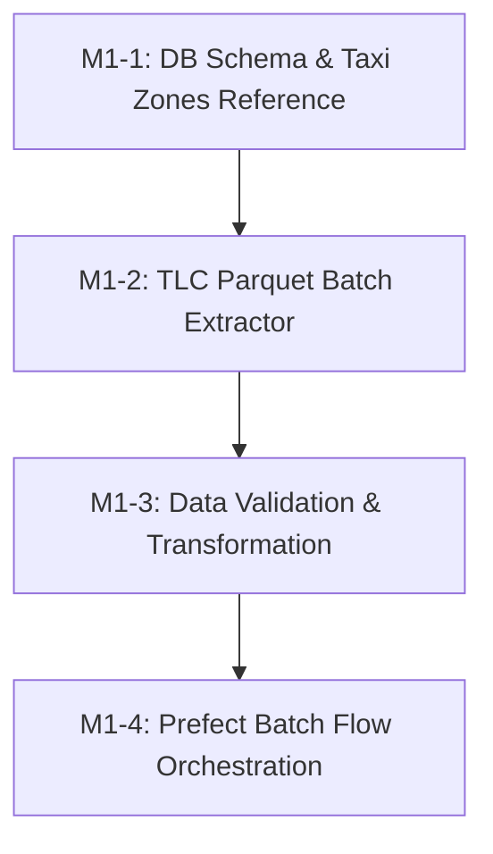

# Ticket Breakdown — Phase 1: Historical ETL

## Epic Summary
Build the historical batch extraction, transformation, and storage pipeline for NYC TLC (Yellow & Green taxi) trip data. Load reference taxi zone data with precomputed centroids, clean and normalize raw Parquet trip data into `raw` and `warehouse` PostgreSQL schemas, and orchestrate the flow with Prefect.

---

## Tickets

### M1-1: Database Schema Migration & Taxi Zones Reference Loader
- **Scope / Acceptance Criteria:**
  - Create PostgreSQL DDL initialization scripts for `raw` and `warehouse` schemas:
    - `warehouse.taxi_zones` (with `zone_id`, `borough`, `zone_name`, `service_zone`, `centroid_lat`, `centroid_lon`).
    - `raw.trips` (staging raw trip records).
    - `warehouse.trips` (partitioned/indexed historical trip records with computed trip duration and 15-minute time bin).
  - Implement a Python loader to download NYC TLC taxi zone lookup data, compute geometric centroids, and insert into `warehouse.taxi_zones`.
  - Unit tests verifying schema creation and zone lookup queries.
- **Per-Ticket Context:** `docs/Database.md`, `docs/Decisions.md` (ADR-008), `docs/Data-Sources.md`.
- **Files Touched:** `src/extract/load_zones.py`, `src/common/db.py`, `tests/test_zones.py`.
- **Estimated Size:** ~150–200 lines.
- **Depends On:** Phase 0 baseline.

### M1-2: Historical TLC Parquet Batch Extractor & Downloader
- **Scope / Acceptance Criteria:**
  - Implement `src/extract/batch_puller.py` to download Yellow and Green taxi monthly Parquet files from NYC TLC CloudFront CDN (`https://d37ci6vzurychx.cloudfront.net/trip-data/`).
  - Support date range filtering (e.g. 2023–2024 monthly batches), retries with exponential backoff, checksum/size validation, and local temporary caching.
  - Fast offline unit tests in `tests/test_extract.py` using mock HTTP responses and synthetic Parquet fixtures to gate every PR.
  - Separate `.github/workflows/etl_live_smoke.yml` workflow triggered on schedule (`cron`) or `workflow_dispatch` (manual) for optional live network integration smoke testing.
  - *Note on Idempotency:* `batch_puller.py` manages local file-level caching (`data/raw/`). Database-level idempotency checking against `warehouse.loaded_months` before extraction/loading is deferred to the M1-4 Prefect batch flow orchestration module.

- **Per-Ticket Context:** `docs/Data-Sources.md`, `docs/ETL-Streaming.md`, `docs/GitHub-Setup.md`.
- **Files Touched:** `src/extract/batch_puller.py`, `tests/test_extract.py`, `.github/workflows/etl_live_smoke.yml`.
- **Estimated Size:** ~150–200 lines.
- **Depends On:** M1-1.

### M1-3: Data Validation, Cleaning & Warehouse Transformation
- **Scope / Acceptance Criteria:**
  - Implement two-stage batch transformation pipeline in `src/extract/raw_loader.py` and `src/transform/batch_transformer.py`:
    - **Stage 1 (Raw Staging)**: Bulk load raw Parquet files into `raw.trips` near-verbatim with minimal transformation (`source_file` tracking).
    - **Stage 2 (Warehouse Transformation)**: Validate, clean, derive features, and load from `raw.trips` (or raw Parquet) into `warehouse.trips`.
  - **Concrete Outlier & Anomaly Rules** (documented in `docs/ETL-Streaming.md`):
    - `trip_duration_seconds`: $60 \le \text{duration} \le 86,400$ (1 min to 24 hrs).
    - `trip_distance`: $0.0 < \text{distance} \le 300.0$ miles.
    - `passenger_count`: $1 \le \text{passengers} \le 9$.
    - `average_speed_mph`: $\le 100.0$ mph.
    - `fare_amount` & `total_amount`: $\ge 0.0$.
  - **Zone-ID Validation**: Drop records with unmapped `PULocationID` or `DOLocationID` (outside standard zones 1–265), logging the total dropped count and specific unmapped IDs seen for auditability.
  - **Deterministic Idempotent `trip_id`**: Generate deterministic UUIDv5 from composite key (`vendor_id`, `pickup_datetime`, `dropoff_datetime`, `PULocationID`, `DOLocationID`, `fare_amount`, `trip_distance`) with `ON CONFLICT (trip_id) DO NOTHING` (or set-based deduplication) to guarantee idempotent re-runs.
  - **Feature Derivation**: `trip_duration_seconds`, `time_bin_15m` (floor timestamp to 15-min interval), day of week, hour of day, rush hour flag.
  - **Auditable Logging**: Log counts per rejection reason (`invalid_duration`, `invalid_distance`, `unmapped_zone`, `speed_anomaly`) without full quarantine table overhead.
- **Per-Ticket Context:** `docs/ETL-Streaming.md`, `docs/Database.md`.
- **Files Touched:** `src/extract/raw_loader.py`, `src/transform/batch_transformer.py`, `tests/test_transform.py`.
- **Estimated Size:** ~200–250 lines.
- **Depends On:** M1-2.

### M1-4: Prefect ETL Batch Flow Orchestration & Worker Integration
- **Scope / Acceptance Criteria:**
  - Implement Prefect flow in `src/orchestration/flows/historical_etl.py` chaining extract -> clean -> load tasks with task retries and state tracking.
  - Update `prefect-worker` service configuration (custom Dockerfile or mounted code) so flows run seamlessly inside the compose topology.
  - Add end-to-end integration test validating a sample month pipeline run from TLC source to Postgres `warehouse.trips`.
- **Per-Ticket Context:** `docs/ETL-Streaming.md`, `docs/Deployment.md`, `docs/Roadmap.md`.
- **Files Touched:** `src/orchestration/flows/historical_etl.py`, `docker-compose.yml`, `tests/test_etl_flow.py`.
- **Estimated Size:** ~150–200 lines.
- **Depends On:** M1-3.

---

## Dependency Graph

## Suggested Execution Order
- **Step 1:** M1-1 (Database Schema & Taxi Zones Reference Loader)
- **Step 2:** M1-2 (TLC Parquet Batch Extractor)
- **Step 3:** M1-3 (Data Validation, Cleaning & Warehouse Transformation)
- **Step 4:** M1-4 (Prefect Batch Flow Orchestration & Worker Integration)
