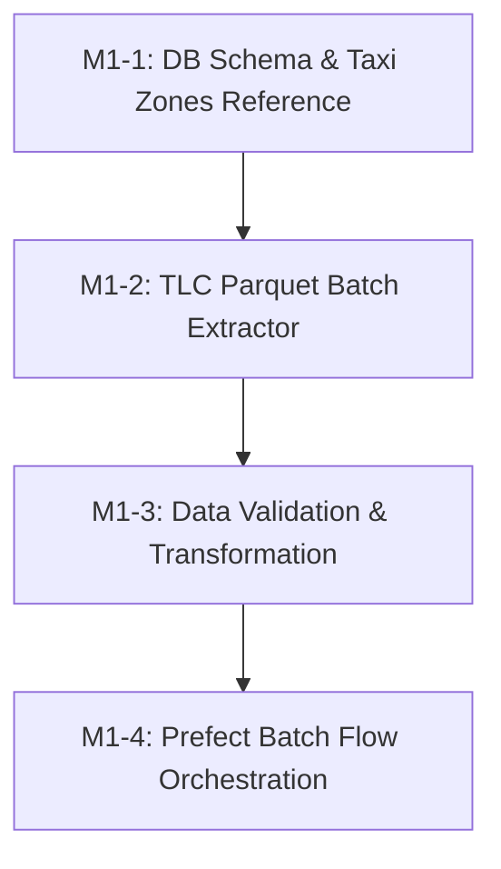

# Ticket Breakdown — Phase 1: Historical ETL

## Epic Summary
Build the historical batch extraction, transformation, and storage pipeline for NYC TLC (Yellow & Green taxi) trip data. Load reference taxi zone data with precomputed centroids, clean and normalize raw Parquet trip data into `raw` and `warehouse` PostgreSQL schemas, and orchestrate the flow with Prefect.

---

## Tickets

### M1-1: Database Schema Migration & Taxi Zones Reference Loader
- **Scope / Acceptance Criteria:**
  - Create PostgreSQL DDL initialization scripts for `raw` and `warehouse` schemas:
    - `warehouse.taxi_zones` (with `zone_id`, `borough`, `zone_name`, `service_zone`, `centroid_lat`, `centroid_lon`).
    - `raw.trips` (staging raw trip records).
    - `warehouse.trips` (partitioned/indexed historical trip records with computed trip duration and 15-minute time bin).
  - Implement a Python loader to download NYC TLC taxi zone lookup data, compute geometric centroids, and insert into `warehouse.taxi_zones`.
  - Unit tests verifying schema creation and zone lookup queries.
- **Per-Ticket Context:** `docs/Database.md`, `docs/Decisions.md` (ADR-008), `docs/Data-Sources.md`.
- **Files Touched:** `src/extract/load_zones.py`, `src/common/db.py`, `tests/test_zones.py`.
- **Estimated Size:** ~150–200 lines.
- **Depends On:** Phase 0 baseline.

### M1-2: Historical TLC Parquet Batch Extractor & Downloader
- **Scope / Acceptance Criteria:**
  - Implement `src/extract/batch_puller.py` to stream/download Yellow and Green taxi monthly Parquet files from NYC TLC CloudFront CDN (`https://d37ci6vzurychx.cloudfront.net/trip-data/`).
  - Support date range filtering (e.g. 2023–2024 monthly batches), retries with exponential backoff, and local temporary caching.
  - Unit tests with mock HTTP responses and sample Parquet datasets.
- **Per-Ticket Context:** `docs/Data-Sources.md`, `docs/ETL-Streaming.md`.
- **Files Touched:** `src/extract/batch_puller.py`, `tests/test_extract.py`.
- **Estimated Size:** ~150–200 lines.
- **Depends On:** M1-1.

### M1-3: Data Validation, Cleaning & Warehouse Transformation
- **Scope / Acceptance Criteria:**
  - Implement batch data transformation pipeline in `src/transform/batch_transformer.py`:
    - Schema validation and column alignment across Yellow/Green TLC formats.
    - Outlier and anomaly filtering: invalid coordinates/zone IDs, negative or > 24hr durations, zero distance with positive fare, invalid passenger counts.
    - Feature derivation: `trip_duration_seconds`, `time_bin_15m`, day of week, hour of day, rush hour indicator.
    - Bulk load cleaned records into `warehouse.trips`.
  - Unit tests for cleaning logic, boundary cases, and transformation validity.
- **Per-Ticket Context:** `docs/ETL-Streaming.md`, `docs/Database.md`.
- **Files Touched:** `src/transform/batch_transformer.py`, `tests/test_transform.py`.
- **Estimated Size:** ~200–250 lines.
- **Depends On:** M1-2.

### M1-4: Prefect ETL Batch Flow Orchestration & Worker Integration
- **Scope / Acceptance Criteria:**
  - Implement Prefect flow in `src/orchestration/flows/historical_etl.py` chaining extract -> clean -> load tasks with task retries and state tracking.
  - Update `prefect-worker` service configuration (custom Dockerfile or mounted code) so flows run seamlessly inside the compose topology.
  - Add end-to-end integration test validating a sample month pipeline run from TLC source to Postgres `warehouse.trips`.
- **Per-Ticket Context:** `docs/ETL-Streaming.md`, `docs/Deployment.md`, `docs/Roadmap.md`.
- **Files Touched:** `src/orchestration/flows/historical_etl.py`, `docker-compose.yml`, `tests/test_etl_flow.py`.
- **Estimated Size:** ~150–200 lines.
- **Depends On:** M1-3.

---

## Dependency Graph

## Suggested Execution Order
- **Step 1:** M1-1 (Database Schema & Taxi Zones Reference Loader)
- **Step 2:** M1-2 (TLC Parquet Batch Extractor)
- **Step 3:** M1-3 (Data Validation, Cleaning & Warehouse Transformation)
- **Step 4:** M1-4 (Prefect Batch Flow Orchestration & Worker Integration)
