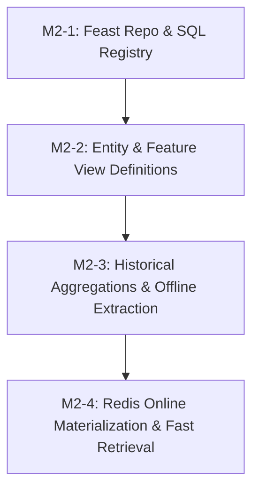

# Ticket Breakdown — Phase 2: Feature Store

## Epic Summary
Implement the self-hosted Feast feature store infrastructure on top of PostgreSQL (offline store and SQL registry) and Redis (online store). Define entities (`zone`, `corridor`) and feature views (`zone_demand_features`, `corridor_duration_features`), build point-in-time correct historical training dataset retrieval from `warehouse.trips`, and implement low-latency online feature materialization into Redis.

---

## Proposed Architecture Decisions

1. **ADR-013: Feast Registry Backend — PostgreSQL SQL Registry (`feast` schema)**:
   - Use Feast's native SQL Registry backend (`registry_type: sql`) pointed to the shared PostgreSQL instance under the `feast` schema (`postgresql+psycopg2://...`).
   - Reuses existing database infrastructure without mounting shared files or introducing object store network latency.
2. **ADR-014: Definition of `origin_zone_demand_pressure` — Raw Rolling Count**:
   - Define `origin_zone_demand_pressure` as the raw 15-minute / 1-hour rolling pickup count of the origin zone from `zone_demand_features`.
   - Eliminates circular dependencies on the demand prediction model at training time, prevents data leakage, and ensures sub-10ms online inference lookup.

---

## Tickets

### M2-1: Feast Repository Setup & PostgreSQL SQL Registry Configuration
- **Scope / Acceptance Criteria:**
  - Create Feast repository in `src/features/` with `feature_store.yaml` configured for:
    - `project: logistics_forecasting`
    - `registry: { registry_type: sql, path: postgresql+psycopg2://... (schema: feast) }`
    - `offline_store: { type: postgres }`
    - `online_store: { type: redis, connection_string: redis://... }`
  - Implement dynamic environment-variable-aware configuration helper in `src/features/config.py` supporting local testing (SQLite/in-memory fallback) and production PostgreSQL/Redis.
  - Implement a CLI/script helper `src/features/registry.py` to run `feast apply` programmatically.
  - Unit tests verifying `feature_store.yaml` parsing and registry initialization.
- **Per-Ticket Context:** `docs/Feature-Store.md`, `docs/Database.md`, `docs/Decisions.md` (ADR-004, ADR-013).
- **Files Touched:** `src/features/feature_store.yaml`, `src/features/config.py`, `src/features/registry.py`, `pyproject.toml`, `tests/test_features_config.py`.
- **Estimated Size:** ~150–200 lines.
- **Depends On:** Phase 1 baseline.

### M2-2: Entity & Feature View Definitions
- **Scope / Acceptance Criteria:**
  - Define Feast Entities in `src/features/entities.py`:
    - `zone`: NYC taxi zone ID (`int32`, join key: `zone_id`).
    - `corridor`: Origin-Destination zone pair (`string`, join key: `corridor_id` formatted as `"{pickup_zone_id}_{dropoff_zone_id}"`).
  - Define Batch Feature Views in `src/features/views.py`:
    - `zone_demand_features` (entity: `zone`):
      - Rolling pickup metrics: `pickup_count_last_15m`, `pickup_count_last_1h`, `pickup_count_last_24h`, `pickup_count_same_hour_last_week`.
      - Calendar & temporal features: `hour_of_day`, `day_of_week`, `is_weekend`, `is_holiday`.
      - Contextual placeholders: `avg_temp_last_1h` (float), `is_precipitating` (boolean) nullable/default until weather feed integration.
    - `corridor_duration_features` (entity: `corridor`):
      - Duration metrics: `avg_duration_last_15m`, `avg_duration_last_1h`.
      - Static & topological features: `distance_km` (float).
      - Cross-feature linkage: `origin_zone_demand_pressure` (raw rolling count from `zone_demand_features` origin zone per ADR-014).
      - Traffic context placeholder: `avg_traffic_speed_current` (float) nullable/default until real-time traffic feed integration.
  - Unit tests validating entity declarations, feature data types, metadata registration, and schema constraints.
- **Per-Ticket Context:** `docs/Feature-Store.md`, `docs/Database.md`, `docs/Decisions.md` (ADR-014).
- **Files Touched:** `src/features/entities.py`, `src/features/views.py`, `tests/test_feature_views.py`.
- **Estimated Size:** ~200–250 lines.
- **Depends On:** M2-1.

### M2-3: Historical Feature Aggregations & Offline Materialization
- **Scope / Acceptance Criteria:**
  - Implement offline data preparation pipeline in `src/features/offline_extractor.py`:
    - Compute and populate historical aggregation tables in PostgreSQL `warehouse` schema: `warehouse.zone_demand_features_hourly` and `warehouse.corridor_duration_features_hourly` computed from `warehouse.trips`.
  - Validate point-in-time correctness with distinct anti-leakage gates:
    - `zone_demand_features`: assert that feature values at observation timestamp $T$ only incorporate trips with `pickup_datetime <= T`.
    - `corridor_duration_features`: assert that feature values at observation timestamp $T$ only incorporate completed trips with `dropoff_datetime <= T`.
  - Integration tests generating sample historical training DataFrames from test trip records.

- **Per-Ticket Context:** `docs/Feature-Store.md`, `docs/Database.md`.
- **Files Touched:** `src/features/offline_extractor.py`, `src/features/sources.py`, `tests/test_offline_features.py`.
- **Estimated Size:** ~200–250 lines.
- **Depends On:** M2-2.

### M2-4: Online Store (Redis) Materialization & Low-Latency Retrieval
- **Scope / Acceptance Criteria:**
  - Implement materialization script and Prefect task in `src/features/materialize.py`:
    - Materialize feature values from offline store to Redis online store across a designated date/time window (`store.materialize(start_date, end_date)`).
    - Configure Redis key expiration / TTL policy (24 hours for rolling hourly features) to bound cache footprint.
  - Implement low-latency online feature retrieval client in `src/features/client.py`:
    - `get_zone_demand_online_features(zone_ids: List[int]) -> List[Dict]`
    - `get_corridor_duration_online_features(corridor_ids: List[str]) -> List[Dict]`
    - Measure and assert feature retrieval latency < 10ms SLA target.
  - End-to-end integration tests: populate test `warehouse.trips` -> `feast materialize` -> verify Redis keys -> execute `get_online_features` and assert exact match.
- **Per-Ticket Context:** `docs/Feature-Store.md`, `docs/Deployment.md`.
- **Files Touched:** `src/features/materialize.py`, `src/features/client.py`, `docker-compose.yml`, `tests/test_online_features.py`.
- **Estimated Size:** ~200–250 lines.
- **Depends On:** M2-3.

---

## Dependency Graph

## Suggested Execution Order
- **Step 1:** M2-1 (Feast Repo Setup & SQL Registry Configuration)
- **Step 2:** M2-2 (Entity & Feature View Definitions)
- **Step 3:** M2-3 (Historical Feature Aggregations & Offline Materialization)
- **Step 4:** M2-4 (Online Store Materialization & Low-Latency Retrieval)
