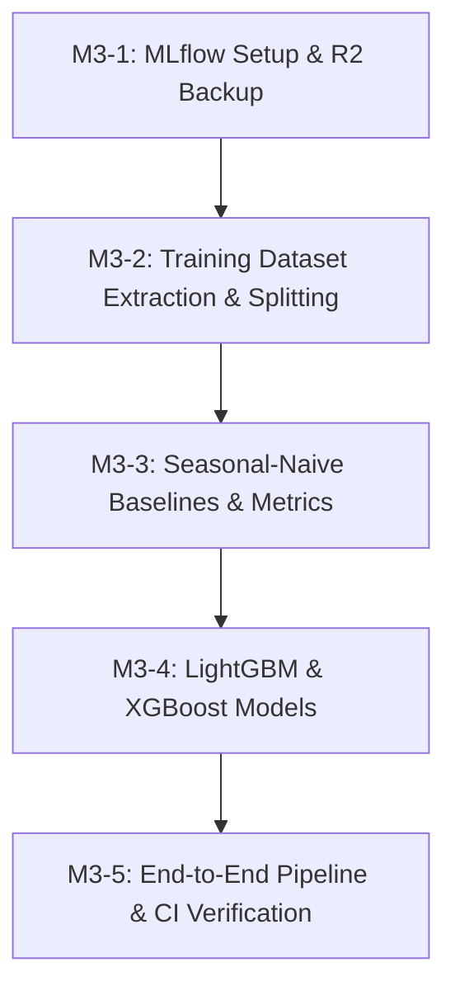

# Ticket Breakdown — Phase 3: Baseline Models & MLflow

## Epic Summary
Implement baseline forecasting models and tabular ML pipelines (LightGBM / XGBoost) for NYC taxi zone demand and corridor trip duration. Set up MLflow experiment tracking and model registry, wire Cloudflare R2 artifact durability backups (ADR-007), implement point-in-time training dataset generation from the Feast offline store with strict time-based validation splits (ADR-016), establish mandatory seasonal-naive benchmarks, and log all model metrics, feature importances, and serialized artifacts to MLflow.

---

## Proposed Architecture Decisions

1. **ADR-007 (Fulfillment): Model Artifact & Database Backup Durability — Cloudflare R2 Integration**:
   - Backup MLflow artifacts (`./mlruns` / PostgreSQL MLflow schema) and periodic database dumps to Cloudflare R2 (S3-compatible API via `boto3`) to ensure artifact durability across VM resets within the 10GB free tier.
2. **ADR-016: Training Dataset Generation — Grid-Based Demand Sampling, Active-Corridor Duration Sampling, and 7-Day Holdout Time Split**:
   - **Demand Sampling**: Full Cartesian grid of 263 taxi zones $\times$ hourly timestamps (`HH:00:00` UTC) over the effective training range ($263 \times 576 = 151,488$ rows for Jan 8–31), avoiding survival bias on low-volume zones. Target: actual pickups in $[T, T+1\text{h})$.
   - **Duration Sampling**: Active corridor-hours grid (corridor-hour pairs with observed trips in $[T, T+1\text{h})$) to avoid $O(Z^2 \times T)$ combinatorial explosion (~100k–300k rows). Target: average completed trip duration in seconds for $[T, T+1\text{h})$.
   - **7-Day Historical Lookback Buffer**: Skip the first 7 days (Jan 1–7) of available data for training observations so that `pickup_count_same_hour_last_week` is 100% populated without artificial null imputation.
   - **Time-Based Split**: Train on `2023-01-08 00:00:00` to `2023-01-24 23:59:59` UTC (~70%); Validate on `2023-01-25 00:00:00` to `2023-01-31 23:59:59` UTC (7 full days = 1 complete weekly cycle, ~30%).

---

## Tickets

### M3-1: MLflow Experiment Tracking Setup & Cloudflare R2 Artifact Backup `[COMPLETED]`
- **Scope / Acceptance Criteria:**
  - Configure MLflow client connection in `src/common/mlflow_utils.py` connecting to the already-running MLflow tracking server (`http://localhost:5000` / `http://mlflow:5000`, PostgreSQL `mlflow` schema-backed since M0/Deployment.md), with SQLite/local directory as a test-isolation fallback only (not re-provisioning the backend).
  - Setup and register canonical MLflow experiments:
    - `nyc-taxi-demand-forecasting`
    - `nyc-taxi-corridor-eta`
  - Implement Cloudflare R2 backup utility in `src/training/r2_backup.py`:
    - S3-compatible client (`boto3`) syncing local MLflow artifacts and database dumps to Cloudflare R2 bucket (`R2_BUCKET_NAME`, `R2_ENDPOINT_URL`, `R2_ACCESS_KEY_ID`, `R2_SECRET_ACCESS_KEY`).
    - Prefect backup task for scheduled/post-training execution.
    - Graceful fallback/noop when R2 credentials are not configured in local/CI environments.
  - Unit tests verifying MLflow client initialization, experiment creation, run logging, and mock R2 sync execution.
- **Per-Ticket Context:** `docs/AI-Pipeline.md`, `docs/Decisions.md` (ADR-007).
- **Files Touched:** `src/common/mlflow_utils.py`, `src/training/r2_backup.py`, `pyproject.toml`, `tests/test_mlflow_and_r2.py`.
- **Estimated Size:** ~200–250 lines.
- **Depends On:** Phase 2 baseline.

### M3-2: Point-in-Time Training Dataset Extraction & Splitting (ADR-016) `[COMPLETED]`
- **Scope / Acceptance Criteria:**
  - Implement training dataset extraction in `src/training/dataset.py`:
    - `generate_demand_training_dataset(...)`: builds $(zone\_id, event\_timestamp)$ entity grid at hour boundaries (`HH:00:00` UTC), computes ground-truth target $Y = \text{pickup\_count\_next\_1h}$ (pickup-anchored departing in $[T, T+1\text{h})$), and joins offline features from Feast via `store.get_historical_features()`.
    - `generate_corridor_training_dataset(...)`: builds $(corridor\_id, event\_timestamp)$ active corridor entity dataframe, computes ground-truth target $Y = \text{avg\_duration\_next\_1h}$ (pickup-anchored mean duration in seconds for trips departing in $[T, T+1\text{h})$), and joins corridor offline features from Feast.
    - `train_val_split_by_time(df, split_timestamp)`: splits datasets chronologically into train (Jan 8–24) and validation (Jan 25–31).
  - Enforce data quality assertions: zero data leakage, no missing values on required rolling/calendar feature columns, and non-empty train/validation partitions.
  - Unit and integration tests validating dataset extraction, feature alignment, target computation, and split boundary isolation.
- **Per-Ticket Context:** `docs/AI-Pipeline.md`, `docs/Feature-Store.md`, `docs/Decisions.md` (ADR-015, ADR-016).
- **Files Touched:** `src/training/dataset.py`, `tests/test_training_dataset.py`.
- **Estimated Size:** ~250–300 lines.
- **Depends On:** M3-1.

### M3-3: Seasonal-Naive Baselines & MLflow Metric Logging `[COMPLETED]`
- **Scope / Acceptance Criteria:**
  - Implement seasonal-naive baseline evaluators in `src/training/baseline.py`:
    - **Demand Baseline**: Predicts `pickup_count_same_hour_last_week` (fallback to `pickup_count_last_24h` or rolling 1h if unobserved).
    - **Duration Baseline**: Predicts corridor moving average `avg_duration_last_1h` (fallback to global corridor average or distance-based velocity heuristic).
  - Implement evaluation metric suite in `src/training/metrics.py`:
    - Regression metrics: MAE, RMSE, WAPE (Weighted Absolute Percentage Error), and per-zone / per-corridor breakdown metrics.
  - Evaluate baselines on the validation split against real 2023-01 data, print real validation metrics, and log baseline benchmark runs to MLflow under the corresponding experiments.
  - Unit tests verifying baseline predictions, metric computations, edge cases (zero demand, extreme values), and MLflow metric logging.

- **Per-Ticket Context:** `docs/AI-Pipeline.md`, `docs/Decisions.md` (ADR-016).
- **Files Touched:** `src/training/baseline.py`, `src/training/metrics.py`, `tests/test_baselines.py`.
- **Estimated Size:** ~200–250 lines.
- **Depends On:** M3-2.

### M3-4: LightGBM & XGBoost Regression Models `[COMPLETED]`
- **Scope / Acceptance Criteria:**
  - Implement model training pipelines in `src/training/train_demand.py` and `src/training/train_duration.py`:
    - Feature matrix preparation (numeric rolling counts, temporal cyclical features `hour_of_day`, `day_of_week`, categorical zone/corridor identifiers, and boolean flags).
    - Train LightGBM Regressor and XGBoost Regressor models.
    - Evaluate trained models on the validation split, compute MAE, RMSE, WAPE, and % lift over the seasonal-naive baseline.
    - Log hyperparameters, training/validation metrics, feature importances (saved as artifacts for LangGraph Ops Copilot explanations in Phase 7), and serialized model binaries to MLflow.
    - Register the best-performing model to the MLflow Model Registry.
  - Unit and integration tests validating model fitting, inference signature, metric logging, feature importance extraction, and registry tracking.
- **Per-Ticket Context:** `docs/AI-Pipeline.md`, `docs/Decisions.md` (ADR-017).
- **Files Touched:** `src/training/train_demand.py`, `src/training/train_duration.py`, `tests/test_training_models.py`.
- **Estimated Size:** ~300–350 lines.
- **Depends On:** M3-3.

### M3-5: End-to-End Training Pipeline & CI Smoke Verification
- **Scope / Acceptance Criteria:**
  - Implement top-level training orchestrator in `src/training/pipeline.py` executing the full workflow: dataset generation -> baseline benchmark -> LightGBM/XGBoost training -> MLflow logging & model registration -> R2 backup task.
  - Add end-to-end training integration test verifying that running the pipeline on sample data produces registered models and logged metrics with zero errors.
  - Update Docker Compose CI smoke checks to verify MLflow tracking connectivity and training pipeline health.
- **Per-Ticket Context:** `docs/AI-Pipeline.md`, `docs/Deployment.md`.
- **Files Touched:** `src/training/pipeline.py`, `src/training/__init__.py`, `tests/test_training_pipeline.py`.
- **Estimated Size:** ~150–200 lines.
- **Depends On:** M3-4.

---

## Dependency Graph

## Suggested Execution Order
- **Step 1:** M3-1 (MLflow Experiment Tracking Setup & Cloudflare R2 Artifact Backup)
- **Step 2:** M3-2 (Point-in-Time Training Dataset Extraction & Splitting)
- **Step 3:** M3-3 (Seasonal-Naive Baselines & MLflow Metric Logging)
- **Step 4:** M3-4 (LightGBM & XGBoost Regression Models)
- **Step 5:** M3-5 (End-to-End Training Pipeline & CI Smoke Verification)
